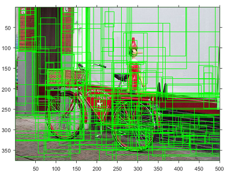

# Selective Search For RCNN

Matlab Scripts and functions to generate selective search boxes for images used in RCNN based methods.  
Support Windows and Linux.  
Support parallel speedup.


## Quick Demo

Run [demo.m](./demo.m) in Matlab.




## Generate boxes for your dataset

1. Modify `idx_file`, `format_string` in [start.m](./start.m)  
   Such as for VOC2012 validation dataset:
   ```matlab
   idx_file = 'path/to/VOCdevkit/VOC2012/ImageSets/Main/val.txt';
   format_string = 'path/to/VOCdevkit/VOC2012/JPEGImages/%s.jpg';
   ```
2. Run start.m, and results will be saved to `output.mat`

### Boost with parallel computing

1. Install [Parallel Computing Toolbox](https://ww2.mathworks.cn/help/distcomp/index.html)
2. Enable [__Automatically create a parallel pool__](https://www.mathworks.com/help/distcomp/parallel-preferences.html) in Matlab preferences.
3. Enjoy huge improvements!!  
   Here is a Example for 20 images:  
   
   

## Disclaimer
1. `selective_search_boxes.m` is copied from [rbgirshick/rcnn](https://github.com/rbgirshick/rcnn) under [BSD-2-Clause](./LICENSE-RCNN.txt) License.
2. `SelectiveSearchCodeIJCV` is downloaded and modified from [SelectiveSearchCodeIJCV.zip](http://huppelen.nl/publications/SelectiveSearchCodeIJCV.zip). See [LICENSE.txt](./SelectiveSearchCodeIJCV/License.txt) for more details.
